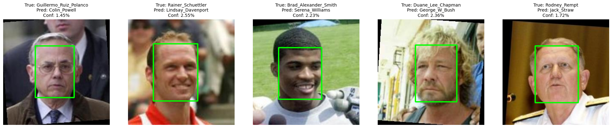
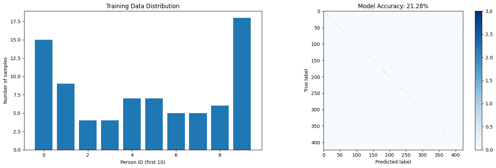

# 🎯 Facial Recognition System using Deep Learning


## 📖 Overview

This project implements a **Facial Recognition System** using Deep Learning and Machine Learning techniques. The system detects human faces using **MTCNN**, extracts facial embeddings using **EfficientNetB0**, and recognizes identities using a **Support Vector Machine (SVM)** classifier.

The project is trained on the **Labeled Faces in the Wild (LFW)** dataset and demonstrates a complete facial recognition pipeline from data preprocessing to prediction.

---

# 📑 Table of Contents

- Overview
- Features
- Technologies Used
- Dataset
- Project Workflow
- Model Architecture
- Results
- Screenshots
- Project Structure
- Installation
- Pre-trained Model
- Future Improvements
- Author

---

# 🚀 Features

- Face Detection using MTCNN
- Deep Feature Extraction using EfficientNetB0
- Multi-Class Face Recognition using SVM
- Automatic Dataset Processing
- Face Embedding Generation
- Model Saving and Loading
- Classification Report
- Confusion Matrix
- Prediction on Unseen Images

---

# 🛠️ Technologies Used

| Technology | Purpose |
|------------|---------|
| Python | Programming Language |
| TensorFlow | Deep Learning |
| TensorFlow Hub | EfficientNetB0 |
| OpenCV | Image Processing |
| MTCNN | Face Detection |
| NumPy | Numerical Computing |
| Scikit-learn | Machine Learning |
| Matplotlib | Visualization |

---

# 📂 Dataset

**Dataset:** Labeled Faces in the Wild (LFW)

The project uses 423 unique identities from the LFW dataset. Images are split into training and testing sets before model training and evaluation.

The dataset contains facial images of people captured under different:

- Pose
- Lighting
- Expression
- Background

---

# 🔄 Project Workflow

```
LFW Dataset
      │
      ▼
Face Detection (MTCNN)
      │
      ▼
Face Cropping
      │
      ▼
Image Preprocessing
      │
      ▼
Feature Extraction
(EfficientNetB0)
      │
      ▼
Feature Vector
      │
      ▼
Support Vector Machine
      │
      ▼
Face Prediction
```

---

# 🧠 Model Architecture

### Face Detection

- MTCNN

### Feature Extraction

- EfficientNetB0 (TensorFlow Hub)

### Classifier

- Support Vector Machine (SVM)

---

# 📊 Results

### Training Configuration

| Parameter | Value |
|-----------|-------|
| Dataset | LFW |
| Persons Used | 423 |
| Feature Extractor | EfficientNetB0 |
| Classifier | SVM |
| Accuracy | **21.28%** |

The proposed facial recognition pipeline successfully detects faces, extracts discriminative facial embeddings, and classifies identities using a Support Vector Machine.

Since the model is trained on **423 different identities**, the classification task is considerably more challenging than experiments using smaller subsets of the LFW dataset.

---

# 📸 Screenshots

## Prediction Demo



---

## Training Accuracy & Confusion Matrix



---

# 📁 Project Structure

```
Facial-Recognition-System/
│
├── Facial_Recognition.ipynb
├── README.md
├── requirements.txt
│
├── model/
│   └── face_recognition_model.pkl
│
└── screenshots/
    ├── prediction_demo.png
    └── training_accuracy.png
```

---

# ⚙️ Installation

## Clone Repository

```bash
git clone https://github.com/jamesalwin1/Facial-Recognition-System.git
```

Move into the project folder:

```bash
cd Facial-Recognition-System
```

Install dependencies:

```bash
pip install -r requirements.txt
```

Launch the notebook:

```bash
jupyter notebook Facial_Recognition.ipynb
```

---

# 📥 Pre-trained Model

The trained model (`face_recognition_model.pkl`) is not included in this repository because it exceeds GitHub's file size limit.

Download it from Google Drive:

**🔗 Google Drive:**  
**[Download face_recognition_model.pkl](https://drive.google.com/file/d/1KH1gC_CujIhtMqLhVHIoWiUgoveMxTa3/view?usp=drive_link)**

After downloading:

1. Create a folder named `model`.
2. Place `face_recognition_model.pkl` inside the `model` folder.
3. Run the notebook normally.

---

# 🔮 Future Improvements

- Real-time webcam recognition
- Unknown face recognition
- Face verification
- Attendance Management System
- Flask/Streamlit Web Application

---

# 👨‍💻 Author

**James Alwin**

B.Tech – Artificial Intelligence and Data Science

**GitHub Profile:**  
https://github.com/jamesalwin1

**Project Repository:**  
https://github.com/jamesalwin1/Facial-Recognition-System

---

# ⭐ Support

If you found this project helpful, consider giving it a ⭐ on GitHub.
